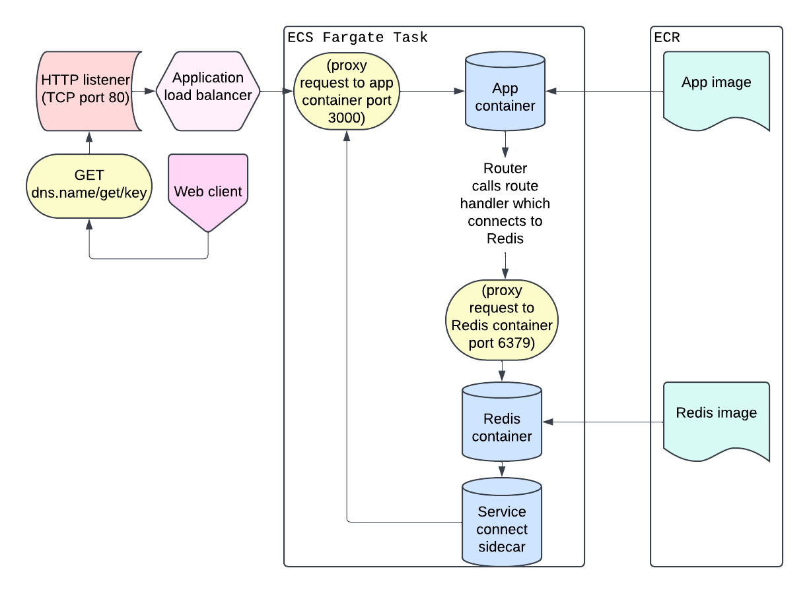

# RedisECS

A working example of a Fargate application with a Node.js Express server.
There's an ECS-EC2 implementation in here as well, but it is not quite complete. I created this
as a proof of concept that for an ECS application, a Redis container can be used in place of a
managed Elasticache instance. Boy oh boy was this a P.I.T.A. Setting up Service Connect to allow
the Node application to connect to Redis took a while to get right.

So if you really wanted to try this out and deploy it, you would need to set up the following:

### VPC 

- A VPC with at least 2 private and public subnets
- Public route table with routes from public subnets to Internet gateway
- Private route table with routes from private subnets to NAT gateway

### ECR

- ECR repository set up
- Docker installed locally (with `buildx`)

Aside from that, as long as you have Terraform installed, you should be able to deploy the application to
your own VPC in your own AWS account.

The chart below shows what containers run in each Fargate task, where the images for those containers are pulled from,
and where a request goes from a web client to the App container to the Redis container. 

